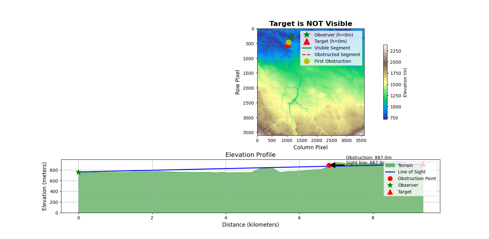

# Hawkshot

<div align="center"></div>


## Project Overview

(work in progress) This project provides tools for analysing line-of-sight visibility (viewshed analysis) between two points using Digital Elevation Model (DEM) data. It helps determine whether a target is visible from an observer's position while accounting for terrain elevations and Earth's curvature over long distances.

<div align="center"></div>

## Installation

Before using the code, you'll need to install the required dependencies:

```bash
conda install -c conda-forge gdal
pip install numpy matplotlib pyproj
```

## Usage
To utilise the script you will need a DTED (generally in a format like .dt2) and 2 coordinates with their respective height levels.

As this script is currently still under testing, you will need to manually change the values in the script. 
