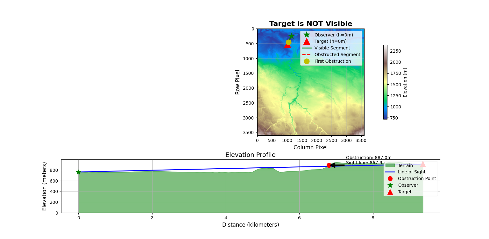

# Hawkshot

<div align="center"></div>

Hawkshot is a line-of-sight (LOS) / viewshed analysis tool for checking whether a target point is visible from an observer point across DEM terrain.

<div align="center"></div>

## What This Project Does

- Loads DEM rasters (GeoTIFF, DTED, and any format supported by `rasterio`)
- Samples terrain between observer and target along a geodesic path
- Computes LOS visibility using observer/target heights
- Optionally applies Earth curvature + atmospheric refraction correction
- Shows both map view and elevation profile
- Provides both CLI and Streamlit frontend interfaces

## Project Structure

```text
hawkshot/
  analysis.py      # LOS math and curvature/refraction model
  dem.py           # DEM loading + geodesic sampling
  plotting.py      # map/profile matplotlib figure creation
  workflow.py      # high-level analysis orchestration
  cli.py           # command-line interface
app.py             # Streamlit frontend
tests/
  test_analysis.py # unit tests for LOS/curvature behavior
  make_demo_dem.py # script to generate a demo DEM raster
```

## Installation

Python 3.10+ is recommended.

```bash
python -m venv .venv
.venv\Scripts\activate
pip install -r requirements-dev.txt
```

Or install as a package:

```bash
pip install -e .[dev]
```

## Frontend (User Input UI)

Run the Streamlit app:

```bash
python -m streamlit run app.py
```

In the UI you can:

- Upload a DEM file or provide a local path
- Enter observer/target lon-lat + heights
- Configure sample spacing and curvature/refraction options
- Run analysis and inspect map/profile output

## CLI Usage

Example:

```bash
python -m hawkshot ^
  --dem tests/data/demo_dem.tif ^
  --observer-lon -115.92 --observer-lat 42.99 ^
  --target-lon -115.80 --target-lat 42.93 ^
  --observer-height-m 2 ^
  --target-height-m 2 ^
  --sample-spacing-m 30 ^
  --plot
```

You can also save a figure:

```bash
python -m hawkshot --dem tests/data/demo_dem.tif ... --output-plot output.png
```

## Test Files To Run

1. Generate a synthetic DEM for local testing:

```bash
python tests/make_demo_dem.py
```

This creates `tests/data/demo_dem.tif`.

2. Run unit tests:

```bash
pytest -q
```

Main test file:

- `tests/test_analysis.py`

## Accuracy Model

Hawkshot now uses:

- Geodesic sampling of observer-target path via `pyproj.Geod`
- Distance-based LOS profile in meters
- Curvature bulge model:
  - `bulge(d) = d * (D - d) / (2 * R_eff)`
  - `R_eff = R_earth / (1 - k)` where `k` is refraction coefficient
- First-obstruction detection along sampled profile

## Current Limitations

- This is pairwise LOS analysis (observer -> one target), not a full 360-degree raster viewshed map yet.
- Terrain-only model: no vegetation/building clutter.
- Elevation sampling uses nearest DEM cells (no bilinear interpolation yet).
- Observer/target points must lie within DEM bounds.
